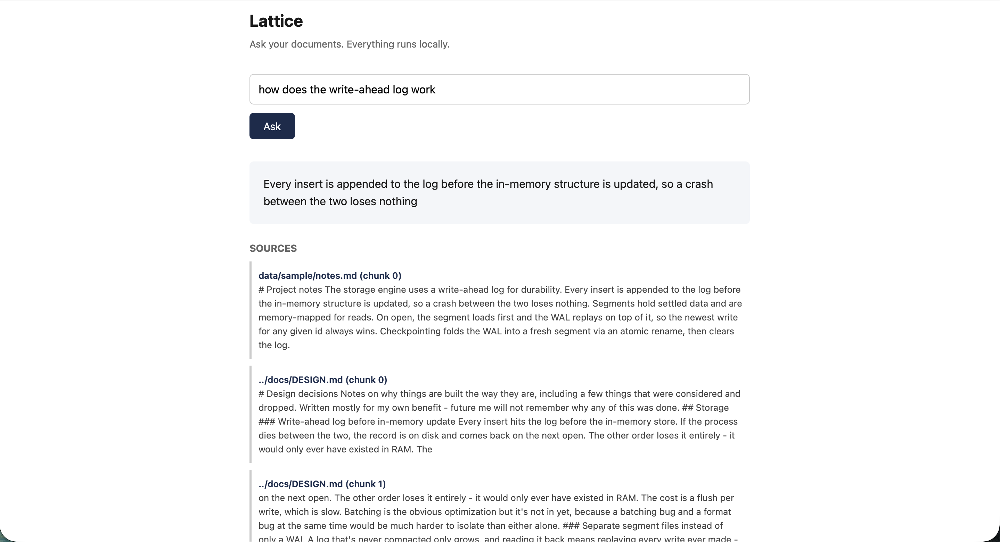

# Lattice

[](https://github.com/amankarki151/lattice/actions/workflows/ci.yml)

An embedded vector database, written from scratch in C++ — a
hand-implemented HNSW index, a disk-backed storage engine with
write-ahead logging, scalar quantization, and a concurrent query path.

Most vector databases are services you run. Lattice is a library you
link against — closer to SQLite than to Postgres. Single node, no
cluster, no network hop unless you want one.

On SIFT (10,000 vectors, 128 dimensions, k=10), Lattice answers
queries in **583µs at 95.4% recall** — about 3.5x faster than Qdrant's
in-memory mode on the same data. Full numbers, including where it
loses, are below.

## Benchmarks

SIFT (10,000 base vectors, 128 dimensions, k=10), against Qdrant
(in-memory mode) and Chroma. Ground truth is SIFT's own precomputed
neighbour list, not derived from any of the systems being compared.

| system | ef | build (s) | recall | p50 (µs) | p99 (µs) |
|---|---|---|---|---|---|
| Lattice | 10 | 18.5 | 0.8980 | 237 | 407 |
| Lattice | 50 | 18.5 | 0.9540 | 583 | 799 |
| Lattice | 100 | 19.0 | 0.9590 | 934 | 1234 |
| Qdrant (in-memory) | — | 0.6 | 1.0000 | 2094 | 2621 |
| Chroma | — | 0.4 | 0.9970 | 311 | 361 |

At every ef tested, Lattice beats Qdrant's query latency by 2x or
more while closing most of the recall gap. Chroma is faster on raw
query latency in this run — that's a real result, not omitted.

Where Lattice loses: build time, by a wide margin (18–19s vs under a
second for both competitors). The gap is partly architectural —
Lattice inserts one vector at a time through an exclusive lock, with
no batch-insert path yet — and partly a benchmark-harness limitation,
since Qdrant and Chroma are both inserted here via their bulk APIs.

## Building

Requires CMake 3.20+, a C++20 compiler, and Python 3.10+.

```bash
git clone https://github.com/amankarki151/lattice.git
cd lattice

pip install pybind11
cmake -B build -Dpybind11_DIR=$(python -m pybind11 --cmakedir)
cmake --build build
```

To build and run the test suite:

```bash
cmake -B build-test -DLATTICE_BUILD_TESTS=ON \
  -Dpybind11_DIR=$(python -m pybind11 --cmakedir)
cmake --build build-test
cd build-test && ctest --output-on-failure
```

## Repository layout

```
core/        the database itself - storage, index, search
core/tests/  30 tests covering storage, search, indexing, quantization
cli/         command-line tool
bindings/    pybind11 Python module
server/      FastAPI HTTP wrapper
bench/       benchmark harness and results
app/         local-first document assistant built on the database
docs/        design decisions and known limitations
```

### SIFT1M (1,000,000 base vectors, 128 dimensions, k=10, ef=50)

| system | build (s) | recall | p50 (µs) | p99 (µs) |
|---|---|---|---|---|
| Lattice | 3954.1 | 0.8831 | 1325 | 2045 |
| Qdrant (in-memory)* | 333.7 | 0.9993 | 232946 | 1728312 |
| Chroma | 105.1 | 0.9775 | 471 | 577 |

\* Qdrant's own client warned before this run started: *"Local mode
is not recommended for collections with more than 20,000 points."*
A p99 of 1.7 seconds confirms it — this reflects local mode's storage
backend at 50x its recommended limit, not Qdrant's real capability.
Measuring Qdrant fairly at this scale would require Docker or Cloud
mode. This row is included for completeness, not as a fair
comparison.

Chroma's numbers here are a legitimate comparison point and it holds
up well at this scale. Lattice's recall dropped from 0.9540 (at 10k
vectors) to 0.8831 (at 1M vectors) at the same ef — consistent with
more vectors meaning more true neighbours competing for the same
top-k slots; a higher ef would recover recall at this size. The
build-time gap seen at 10k also holds at 1M scale — Lattice takes
3954s against Chroma's 105s — confirming this is a systemic
architectural cost, not an artifact of the smaller dataset.

This is not a like-for-like comparison. Qdrant and Chroma are full
services with networking, persistence policies, filtering, and
metadata support. Lattice is an embedded library. Some of their
latency is buying features Lattice doesn't have. Qdrant runs in
`:memory:` mode here specifically to remove the network hop, as the
closest available approximation to comparing against a library.

Full methodology and raw output in [bench/results.md](bench/results.md).

### Document assistant

A local-first assistant built on top of the database: ingest notes or
PDFs, ask questions in plain language, get answers with citations.
Everything runs on-device.



## Status

Storage, search, indexing, quantization, concurrency, interfaces,
CI, and a working document assistant:

- Append-only write-ahead log with replay
- Memory-mapped segment files for settled data
- Recovery on open: load the segment, replay the WAL on top
- Checkpointing folds the WAL into a new segment via atomic rename
- Brute-force k-nearest-neighbour search over squared L2 distance
- HNSW index: layered graph construction, neighbour pruning, and
  coarse-to-fine search, with recall measured against the exact path
- Scalar quantization: float32 to uint8, 4x smaller, with the recall
  and speed cost measured rather than assumed
- Concurrent query path: many readers alongside a single writer,
  verified clean under the thread sanitizer
- Python bindings via pybind11, with the GIL released around calls
- A FastAPI HTTP server wrapping the bindings
- GoogleTest suite: 30 tests covering storage, search, indexing, and
  quantization
- CI that runs the tests and fails the build on a benchmark regression
- A local-first document assistant: ingest a folder of notes or PDFs,
  search them by meaning, entirely offline

Next: a multi-step agent loop and a GUI on top of the assistant.

## Writing

- [Building an HNSW index from scratch](https://amankarki.hashnode.dev/building-an-hnsw-index-from-scratch)

## Usage

```bash
lattice /path/to/db insert 1 1.0,0.0,0.0
lattice /path/to/db query 1.0,0.0,0.0 5
lattice /path/to/db checkpoint
lattice /path/to/db stats
```

## Building

```bash
cmake -B build
cmake --build build
```
## Known limitations

- **Build time is slow.** 66 minutes for a million vectors, against
  Chroma's 105 seconds. Partly architectural (single-writer, no batch
  insert path), partly a benchmark artifact (competitors are fed
  through bulk APIs, Lattice isn't).
- **Single node only.** No sharding, no replication. This is a
  library, not a cluster.
- **The assistant produces nonsense for out-of-scope questions.**
  Asked something the documents don't cover, the local synthesis
  model returns malformed text rather than refusing. Real example and
  screenshot in the design doc.
- **Citation precision is imperfect.** Of four cited sources,
  typically one or two are directly relevant and the rest are
  topically adjacent.
- **No per-record checksums.** Torn writes are caught; silent bit
  corruption inside an otherwise-valid record isn't.

Full detail and reasoning in [docs/DESIGN.md](docs/DESIGN.md).

## License

MIT