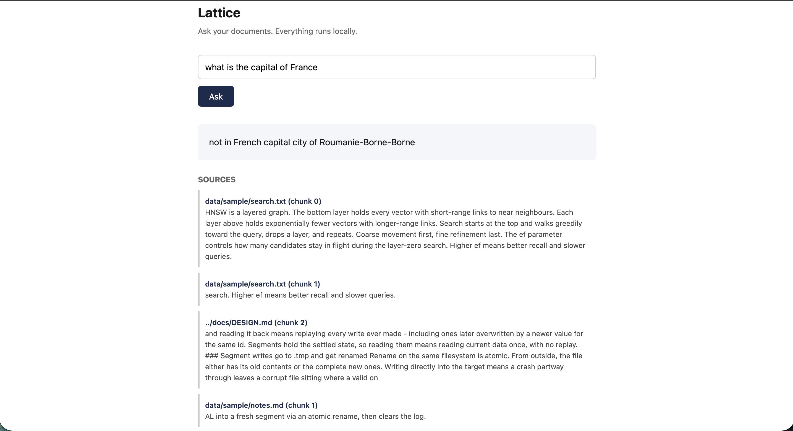

# Design decisions

Notes on why things are built the way they are, including a few things
that were considered and dropped. Written mostly for my own benefit -
future me will not remember why any of this was done.

## Storage

### Write-ahead log before in-memory update

Every insert hits the log before the in-memory store. If the process
dies between the two, the record is on disk and comes back on the next
open. The other order loses it entirely - it would only ever have
existed in RAM.

The cost is a flush per write, which is slow. Batching is the obvious
optimization but it's not in yet, because a batching bug and a format
bug at the same time would be much harder to isolate than either alone.

### Separate segment files instead of only a WAL

A log that's never compacted only grows, and reading it back means
replaying every write ever made - including ones later overwritten by
a newer value for the same id. Segments hold the settled state, so
reading them means reading current data once, with no replay.

### Segment writes go to .tmp and get renamed

Rename on the same filesystem is atomic. From outside, the file either
has its old contents or the complete new ones. Writing directly into
the target means a crash partway through leaves a corrupt file sitting
where a valid one used to be, with no way for the next open to tell.

### Segments are mmap'd, not read()

The OS pages data in on demand, so opening a large segment is cheap and
only the parts actually touched cost anything.

The catch: record offsets aren't guaranteed to be aligned, since each
record's size depends on its own dimension. So fields get pulled out
with memcpy rather than by casting the mapped pointer to uint64_t* and
dereferencing it. A misaligned load through a cast is undefined
behaviour even on hardware that tolerates it in practice.

### Magic number and version in the segment header

Tested by deliberately corrupting a real segment file - overwriting the
first four bytes - and confirming the reader refused it rather than
reading the garbage as a valid header. Without the check, a corrupt
file gets interpreted as a real version and record count, which could
mean anything from wrong results to trying to allocate on a garbage
count.

### Recovery order: segment first, then WAL on top

The segment is settled state, the WAL is everything since. Loading them
the other way round means older segment data overwrites newer WAL
writes for any id in both, silently reverting real writes.

### Checkpoint order: write segment, then clear WAL

Crash between the two and the WAL just gets replayed on top of a segment
that may already contain the same records - harmless, since inserting an
id twice overwrites it with itself. The reverse order loses anything
that hadn't made it into the new segment yet.

## Search

### Squared L2, no sqrt

sqrt is monotonic so it doesn't change result ordering - if a < b then
sqrt(a) < sqrt(b). Leaving it out saves a sqrt per comparison and the
ranking is identical. Only worth taking if an actual distance value
needs reporting.

### Cosine similarity isn't supported yet

L2 works directly on raw vectors. Cosine needs normalized ones to mean
anything. It's easy to add later - normalize on insert and cosine
becomes a dot product - but it's not needed to get the index working,
so it's not in.

### A max-heap rather than sorting everything

Sorting all scores is O(n log n) and holds all n results in memory. The
heap is O(n log k) and only ever holds k. For k=10 against a million
vectors that's a real difference.

Max-heap rather than min-heap because the thing needing constant access
is the *worst* of the current best - that's what gets evicted when
something better turns up.

### Brute-force search stays permanently

It's not scaffolding. Once HNSW exists, this is what HNSW gets checked
against - an approximate index that disagrees with an exact scan is
wrong. It's also genuinely the right choice for small collections,
where building and walking a graph costs more than just scanning.

## Query planner

There's one real strategy right now, so the planner looks like overkill.
It's in early because the alternative is retrofitting a decision point
into every call site once HNSW lands - one function to change instead
of many.

The exact/approximate threshold is a placeholder. It gets set from real
benchmark numbers, not guessed at now.

## Things deliberately not done yet

- No batching of WAL flushes (correctness first)
- No checksums on records - a flipped bit inside a record that's still
  the right length passes silently today
- No compaction - the WAL only shrinks at checkpoint, segments are
  rewritten whole
- Single node only. No sharding, no replication.

## Known limitations

Everything here is a deliberate scope decision or a measured
shortcoming, not a surprise. Listed because a design doc that only
covers what works isn't a design doc.

### Build time is slow

Index construction takes 18-19 seconds for 10,000 vectors and about
66 minutes for 1,000,000. Chroma does the same million in 105
seconds. Two separate causes, worth keeping distinct:

Architectural: inserts take an exclusive lock and go one vector at a
time. There's no batch-insert path, so there's no opportunity to
amortize lock acquisition or to parallelize graph construction.

Measurement: the benchmark inserts into Lattice one call at a time
through the Python bindings, while Qdrant and Chroma are fed through
their bulk APIs. Some of the gap is that Lattice isn't being given
the same advantage, not that its algorithm is worse.

A batch-insert path is the single clearest thing to fix next.

### Single node only

No sharding, no replication, no distributed query. This is an
embedded library - closer to SQLite than to Postgres. Scaling past
one machine isn't a planned feature; it's out of scope by design.

### Product quantization isn't implemented

Scalar quantization (float32 to uint8, 4x smaller) is done and
measured. Product quantization would compress much further and is a
documented future direction, not a current capability.

### The document assistant's sidecar is JSON

Lattice stores vectors keyed by uint64 and doesn't store text, so the
app keeps a JSON file mapping ids back to source text. That means
loading the whole mapping into memory and rewriting the entire file
on every save. Fine for thousands of chunks. Not fine for hundreds of
thousands. SQLite is the obvious upgrade and hasn't been done.

### The assistant produces nonsense for out-of-scope questions

This is the sharpest limitation and worth showing rather than
describing. Asked "what is the capital of France" - something no
document in the corpus mentions - the assistant returned:

> not in French capital city of Roumanie-Borne-Borne

Not a refusal. Not a plausible-but-wrong answer. Malformed garbage,
presented in the same UI as a correct answer, with nothing signalling
to the user that anything went wrong.

Retrieval and re-ranking behaved correctly here: all four cited
sources were about HNSW internals and storage, because nothing in the
corpus is about France. The failure is entirely at synthesis. The
prompt instructs the model to say so when the context lacks the
answer, and flan-t5-base does not reliably honour that.

A larger model would handle this better. Using one would mean sending
user documents to a hosted API, which defeats the premise of a
local-first tool. This is the cost of that choice, stated plainly.

### Citation precision is imperfect

Even on questions it answers correctly, the re-ranker returns four
sources and typically only one or two are directly on point. The
others are topically adjacent - crash-safety passages surfacing for a
question about temporary files, for instance. Users should treat the
citation list as "related passages", not "the exact four sources this
answer came from".

### No checksums on records

Torn writes are caught, because a short read fails and replay stops
there. A flipped bit inside a record that's still the correct length
would pass silently. Per-record checksums would fix this and aren't
implemented.

### The Qdrant benchmark comparison is not apples-to-apples

Qdrant runs in `:memory:` local mode in the benchmarks, which its own
client warns against above 20,000 points. At 1,000,000 points its p99
was 1.7 seconds - that reflects local mode falling over, not Qdrant's
real performance. Measuring Qdrant fairly at that scale needs Docker
or Cloud mode, which hasn't been done. The 10,000-vector comparison,
where all three systems are inside their intended operating range, is
the fair one.